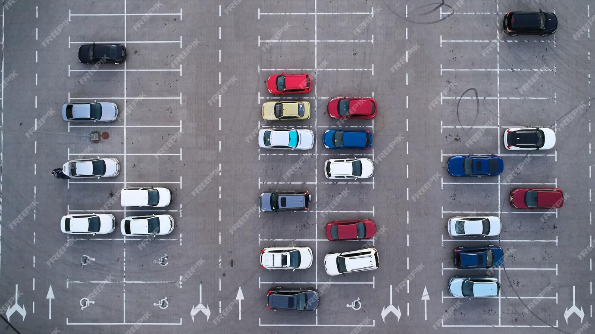

## Gestion des zones de stationnements grâce à la vision par ordinateur
### Les dossiers les plus utiles et dignes de mon programme sont :
* /home/ahmed/Bureau/Projet/OpenCV/classes/StructureCLasses.py
* /home/ahmed/Bureau/Projet/OpenCV/main/test.py
* /home/ahmed/Bureau/Projet/OpenCV/images

## Problèmatique
* Il me faut revoir la façon de sauvetager mes traces d'observations dans le dossier vues.
* Il me faut aussi optimiser mon programme dans les fichiers : **``/home/ahmed/Bureau/Projet/OpenCV/main/main.py & /home/ahmed/Bureau/Projet/OpenCV/classes/reconnaissanceTexte.py``** dont l'observation se fait dans : **``/home/ahmed/Bureau/Projet/OpenCV/search``**
* [:(] Revoir la fonction de collecte des information sur l'entreprise pour mieux faire le tri dans **``when_open(company)``** dans le dossier **/home/ahmed/Desktop/Projet/OpenCV/classes/own_code/Structure.py** Car parfois j'ai des résultats fausses
* [:(] Revoir La fonction ``ParkingField()`` pour mieux repéerer les places totales sur une images i.e parking surtout pour celle dont les places sont délimiter par une frontiere. [ emplacement à une colonne] Solution Possible (YOLO) dans **``/home/ahmed/Desktop/Projet/OpenCV/classes/own_code/ParkingPlace.py``**

### NOTE de place
J'ai 38 place de libre en total sur mon parking illustré par l'image

Dont 5 place pour personnes handicapés

### Librairie utilisé

> pip install mysql-connector-python # Pour la connexion à la base de donnée

# Penser à utiliser KAFKA pour l'optimisation des données